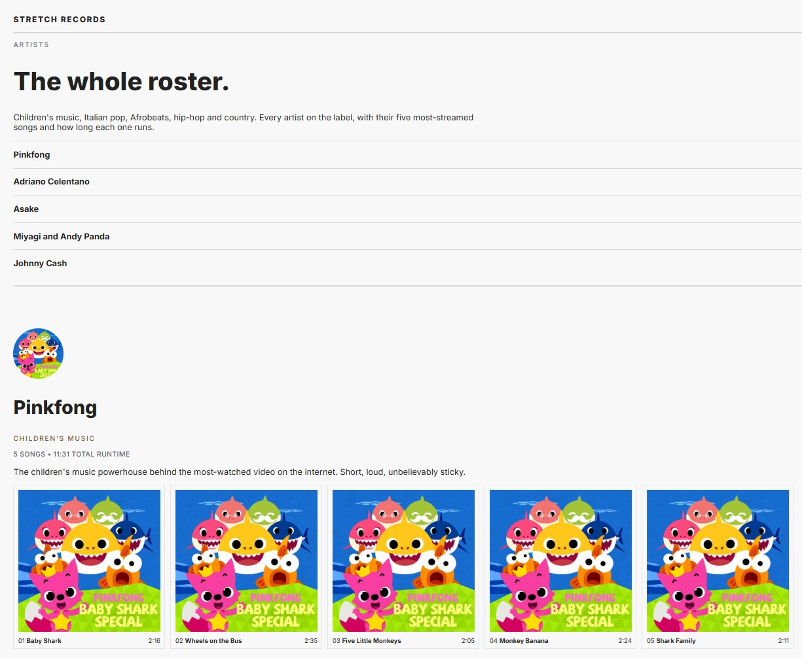
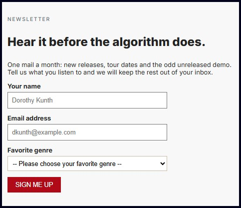

# Stretch Records

A responsive single-page website for **Stretch Records**, a fictional record label featuring five artists from different music genres. The site showcases each artist, their top songs, and includes a newsletter signup form with accessible, semantic HTML and modern CSS styling.

## Live Demo

🔗 https://dskunth.github.io/stretch-records/

## Features

- Semantic HTML5 structure
- Responsive single-page layout
- Jump navigation to each artist section
- Artist profile sections with:
  - Circular artist avatars
  - Genre and runtime metadata
  - Artist descriptions
  - Top five songs displayed as ranked cards
- Newsletter signup form with:
  - Name and email fields
  - Genre selection
  - Accessible labels
  - Visible keyboard focus states
  - GET form submission
- Alternating section backgrounds using `:nth-child(even)`
- Accessible color contrast following WCAG guidelines
- Italian song titles marked with `lang="it"` for improved screen reader pronunciation

## Technologies Used

- HTML5
- CSS3
- Flexbox
- Git & GitHub
- GitHub Pages

## Accessibility

This project was built with accessibility in mind:

- Semantic HTML elements
- Proper heading hierarchy
- Labels associated with form controls
- Keyboard-visible focus styles
- WCAG-compliant color contrast
- Language attributes for Italian song titles
- Descriptive alternative text for images

## What I Learned

- Structuring web pages with semantic HTML
- Styling layouts using CSS and Flexbox
- Building accessible forms
- Applying responsive spacing and typography
- Using Git feature branches and Pull Requests
- Managing a development workflow with GitHub

## What is in this repository

- `index.html` – The main page featuring five artists, their top songs, and a newsletter signup form.
- `css/style.css` – Stylesheet for the site's layout, typography, colors, Flexbox layouts, forms, and accessibility enhancements.
- `images/` – Artist photos and album artwork used throughout the website.
- `artist-dataset.md` - the source of truth for every artist, song, duration, genre, blurb, and cover assignment.
- `README.md` – Project documentation, features, technologies used, and setup information.

## Screenshot

## Acknowledgements

This project was completed as part of a Web Foundations course. The original project brief and assets were provided by the course instructor. The implementation, HTML structure, CSS styling, accessibility improvements, and Git workflow were completed by me.
